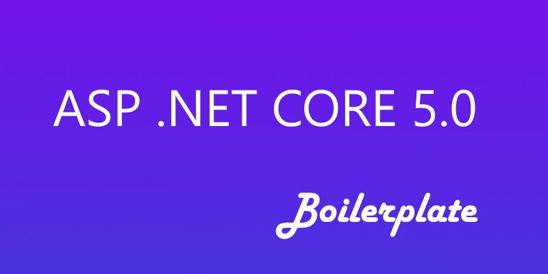

<!-- PROJECT SHIELDS -->

[![Contributors][contributors-shield]][contributors-url]
[![Forks][forks-shield]][forks-url]
[![Stargazers][stars-shield]][stars-url]
[![Issues][issues-shield]][issues-url]
[![MIT License][license-shield]][license-url]
[![LinkedIn][linkedin-shield]][linkedin-url]

<!-- PROJECT LOGO -->
<br />
<p align="center">
  <a href="https://github.com/aspnetcorehero/Boilerplate">
    
  </a>

  <h3 align="center">Clean Architecture Boilerplate</h3>

  <p align="center">
    For ASP.NET Core 5.0 (WebApi & MVC)
    <br />
    <a href="https://codewithmukesh.com/blog/aspnet-core-hero-boilerplate-quick-start/"><strong>Explore the docs »</strong></a>
    <br />
    <br />
    <a href="https://github.com/aspnetcorehero/Boilerplate/issues">Report Bug</a>
    ·
    <a href="https://github.com/aspnetcorehero/Boilerplate/issues">Request Feature</a>
  </p>
</p>

<!-- TABLE OF CONTENTS -->
<details open="open">
  <summary>Table of Contents</summary>
  <ol>
    <li>
      <a href="#about-the-project">About The Project</a>
      <ul>
        <li><a href="#built-with">Built With</a></li>
      </ul>
    </li>
    <li>
      <a href="#getting-started">Getting Started</a>
      <ul>
        <li><a href="#prerequisites">Prerequisites</a></li>
        <li><a href="#features-included">Features Included</a></li>
        <ul>
            <li><a href="#aspnet-core-50-mvc-project">ASP.NET Core 5.0 MVC Project</a></li>
            <li><a href="#aspnet-core-50-webapi">ASP.NET Core 5.0 WebAPI</a></li>
        </ul>
      </ul>
    </li>
    <li><a href="#usage">Usage</a></li>
    <li><a href="#roadmap">Roadmap</a></li>
    <li><a href="#contributing">Contributing</a></li>
    <li><a href="#license">License</a></li>
    <li><a href="#contact">Contact</a></li>
    <ul>
        <li><a href="#mukesh-murugan">Mukesh Murugan</a></li>
    </ul>
    <li><a href="#support">Support</a></li>
    <li><a href="#acknowledgements">Acknowledgements</a></li>
  </ol>
</details>

## About The Project

Clean Architecture Solution Template for ASP.NET Core 5.0. Built with Onion/Hexagonal Architecture and incorporates the most essential Packages your projects will ever need. Includes both WebApi and Web(MVC) Projects.

### Built with

-   [ASP.NET Core 5.0 MVC](https://dotnet.microsoft.com/learn/aspnet/what-is-aspnet-core)
-   ASP.NET Core 5.0 WebAPI
-   [Entity Framework Core 5.0](https://docs.microsoft.com/en-us/ef/core/)

## Getting Started

An idea to bring together the best and essential practices / packages of ASP.NET Core 5.0 along with Clean Hexagonal Architecture that can be a right fit for small/mid and enterprise level solutions.
How easy would it be if you are able to run a single line of CLI command on your Console and you get a complete implementation in no time? That's the exact vision I have while building this full-fledged Boilerplate template.

### Prerequisites

-   Make sure you are running on the latest .NET 5 SDK (SDK 5.0 and above only). [Get the latest one here.](https://dotnet.microsoft.com/download/dotnet/5.0)

-   Visual Studio 2019 (v16.8+) (You can check out my Installation Guide of [Visual Studio 2019 Community](https://codewithmukesh.com/blog/install-visual-studio-2019-community/) which is completely Free to use.) Make sure that ASP.NET and web development workload is installed.

-   Install the latest [.NET & EF CLI Tools](https://docs.microsoft.com/en-us/ef/core/cli/dotnet) by using this command :

    ```.NET Core CLI
    dotnet tool install --global dotnet-ef
    ```

-   I recommend that you read [Onion Architecture In ASP.NET Core With CQRS – Detailed](https://codewithmukesh.com/blog/onion-architecture-in-aspnet-core/) article to understand this implementation much better. This project is just an Advanced Version of the mentioned article.

-   Once you clear with Onion Architecture Implementation, you will also need to be aware of CQRS MediatR Pattern. I have written a step-by-step guide on how to implement CQRS using MediatR Library. [Read it here.](https://codewithmukesh.com/blog/cqrs-in-aspnet-core-3-1/)

### Features Included

#### ASP.NET Core 5.0 MVC Project

-   Slim Controllers using MediatR Library
-   Permissions Management based on Role Claims
-   Toast Notification (includes support for AJAX Calls too)
-   Serilog
-   ASP.NET Core Identity
-   AdminLTE Bootstrap Template (Clean & SuperFast UI/UX)
-   AJAX for CRUD (Blazing Fast load times)
-   jQuery Datatables
-   Select2
-   Image Optimization
-   Includes Sample CRUD Controllers / Views
-   Active Route Tag Helper for UI
-   RTL Support
-   Complete Localization Support / Multilingual
-   Clean Areas Implementation
-   Dark Mode!
-   Default Users / Roles Seeding at Startup
-   Supports Audit Logging / Activity Logging for Entity Framework Core
-   Automapper

#### ASP.NET Core 5.0 WebAPI

-   JWT & Refresh Tokens
-   Swagger

(will be updated soon)

## Usage

-   [Get the NuGet Package from here!](https://www.nuget.org/packages/AspNetCoreHero.Boilerplate/)

-   [Getting Started - Quick Start Guide](https://codewithmukesh.com/blog/aspnet-core-hero-boilerplate-quick-start-guide/)

-   [View the Project Page](https://codewithmukesh.com/project/aspnet-core-hero-boilerplate/)

## Roadmap

See the [open issues](issues-url) for a list of proposed features (and known issues).

-   ~~Fix typos on this Readme, or prepare a better one.~~
-   Add Localizers throughout the MVC Project.
-   Add Arabic Translations throughout the MVC Project. You can find the Dictionary under the Resources Folder in the Web Project.
-   Ensure the code quality.

Let's make this the best .NET 5 Clean Architecture Template.

## Contributing

Contributions are what make the open-source community such an amazing place to be learn, inspire, and create. Any contributions you make are **greatly appreciated**.

1. Fork the Project
2. Create your Feature Branch (`git checkout -b feature/AmazingFeature`)
3. Commit your Changes (`git commit -m 'Add some AmazingFeature'`)
4. Push to the Branch (`git push origin feature/AmazingFeature`)
5. Open a Pull Request

## License

Distributed under the MIT License. See `LICENSE` for more information.

## Contact

### Mukesh Murugan

-   Blogs at [codewithmukesh.com](https://www.codewithmukesh.com)
-   Facebook - [codewithmukesh](https://www.facebook.com/codewithmukesh)
-   Twitter - [Mukesh Murugan](https://www.twitter.com/iammukeshm)
-   Twitter - [codewithmukesh](https://www.twitter.com/codewithmukesh)
-   Linkedin - [Mukesh Murugan](https://www.linkedin.com/in/iammukeshm/)

## Support

Has this Project helped you learn something New? or Helped you at work? Do Consider Supporting. Here are a few ways by which you can support.

-   Leave a star! ⭐️
-   Recommend this awesome project to your colleagues.
-   Do consider endorsing me on LinkedIn for ASP.NET Core - [Connect via LinkedIn](https://codewithmukesh.com/linkedin)
-   Or, If you want to support this project on the long run, consider buying me a coffee.

<a href="https://www.buymeacoffee.com/codewithmukesh" target="_blank"></a>

## Acknowledgements

-   [Best-README-Template](https://github.com/othneildrew/Best-README-Template)
-   [Img Shields](https://shields.io)

<!-- MARKDOWN LINKS & IMAGES -->
<!-- https://www.markdownguide.org/basic-syntax/#reference-style-links -->

[contributors-shield]: https://img.shields.io/github/contributors/aspnetcorehero/Boilerplate.svg?style=flat-square
[contributors-url]: https://github.com/aspnetcorehero/Boilerplate/graphs/contributors
[forks-shield]: https://img.shields.io/github/forks/aspnetcorehero/Boilerplate?style=flat-square
[forks-url]: https://github.com/aspnetcorehero/Boilerplate/network/members
[stars-shield]: https://img.shields.io/github/stars/aspnetcorehero/Boilerplate.svg?style=flat-square
[stars-url]: https://img.shields.io/github/stars/aspnetcorehero/Boilerplate?style=flat-square
[issues-shield]: https://img.shields.io/github/issues/aspnetcorehero/Boilerplate?style=flat-square
[issues-url]: https://github.com/aspnetcorehero/Boilerplate/issues
[license-shield]: https://img.shields.io/github/license/aspnetcorehero/Boilerplate?style=flat-square
[license-url]: https://github.com/aspnetcorehero/Boilerplate/blob/master/LICENSE
[linkedin-shield]: https://img.shields.io/badge/-LinkedIn-black.svg?style=flat-square&logo=linkedin&colorB=555
[linkedin-url]: https://www.linkedin.com/in/iammukeshm/
